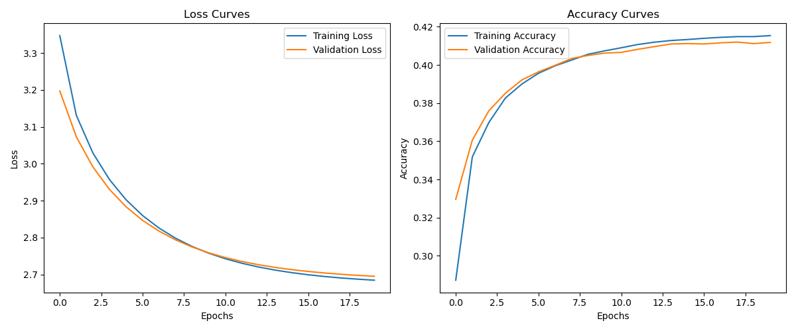
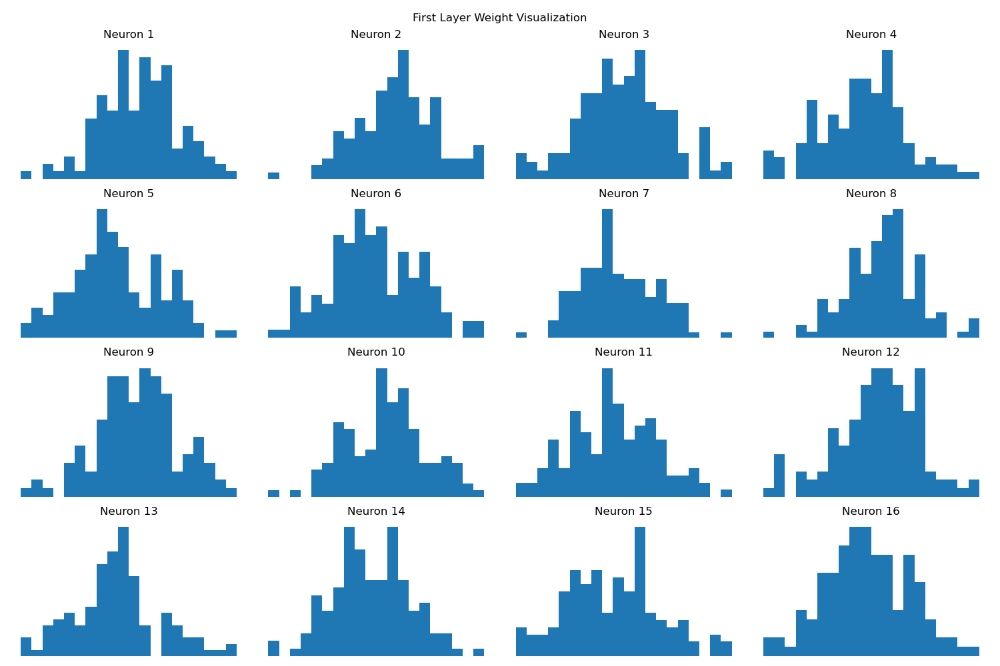
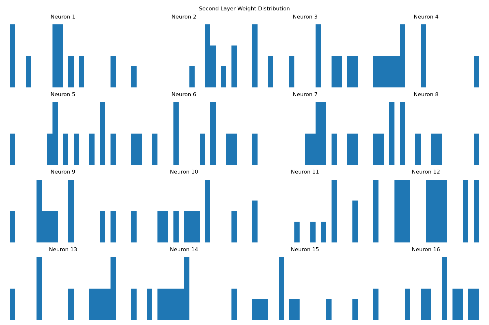
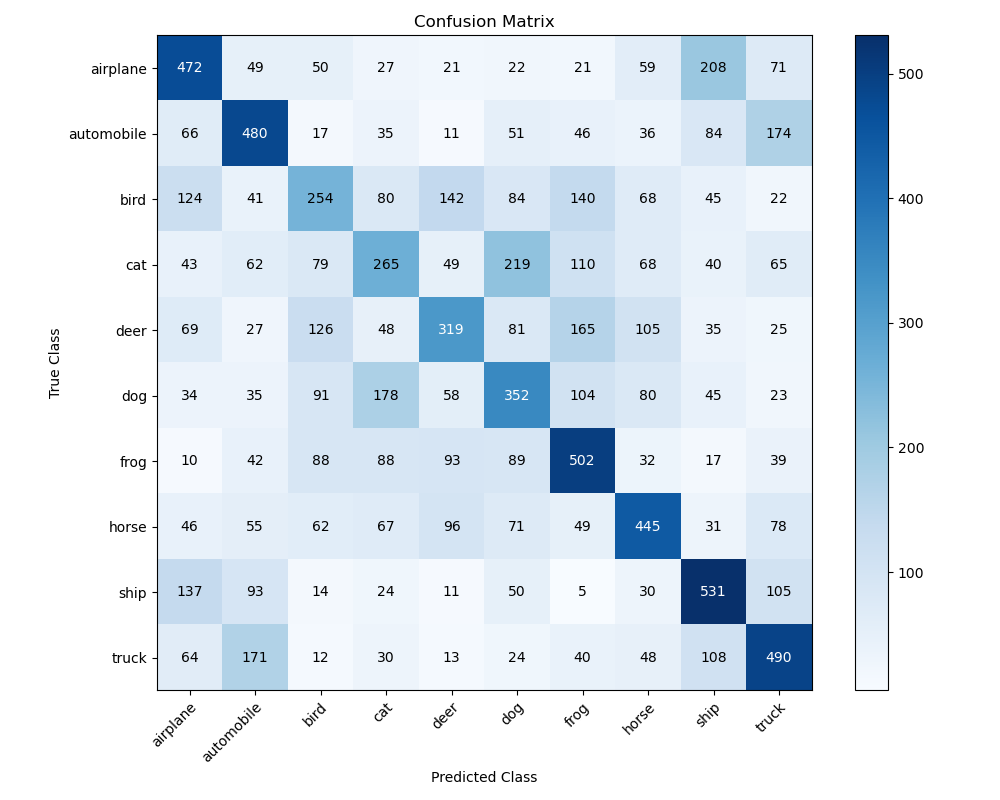

# CIFAR-10 Image Classification Experiment Report

## 1. Model Introduction

This experiment uses a three-layer neural network for image classification on the CIFAR-10 dataset. The network structure is as follows:
- Input Layer: 3072 neurons (32x32x3)
- Hidden Layer: 128 neurons with ReLU activation function
- Output Layer: 10 neurons with Softmax activation function

## 2. Dataset Introduction

CIFAR-10 is an image dataset containing 10 classes, with 6000 32x32 color images per class.
- Training Set: 50000 images
- Test Set: 10000 images
- Classes: airplane, automobile, bird, cat, deer, dog, frog, horse, ship, truck

## 3. Training Process

The following hyperparameters were used during training:
- Learning Rate: 0.01
- Learning Rate Decay: 0.95
- Batch Size: 128
- Epochs: 20
- L2 Regularization Strength: 0.01

The loss and accuracy changes during training are shown in the following figure:

## 4. Network Parameter Analysis

### 4.1 Weight Distribution

Layer 1 Weight Distribution:

Layer 2 Weight Distribution:

### 4.2 Neuron Visualization

Layer 1 Neuron Weights Visualization:

### 4.3 Weight Correlation

Layer 1 Neuron Weight Correlation:

## 5. Experimental Results

Confusion Matrix on Test Set:

Final Test Set Accuracy: 0.4110
    